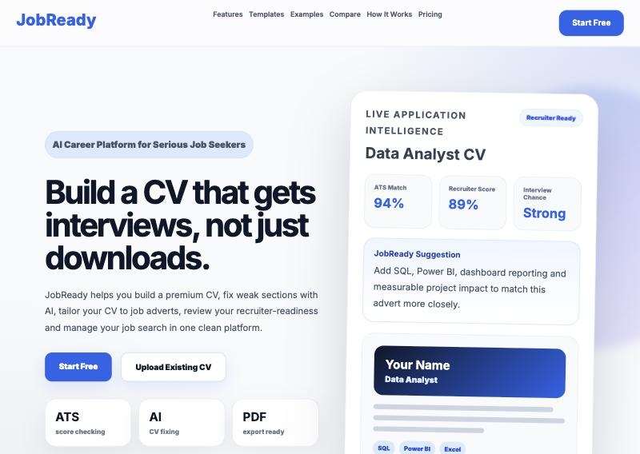

# JobReady

[](https://github.com/Mubarakjk/jobready/actions/workflows/ci.yml)

An AI career platform for UK job seekers. Build a CV, score it the way a recruiter would, tailor it to a job advert, practise interviews and track applications, all in one place.



## Features

**CV tools**
- CV builder with templates and PDF export
- Import an existing CV from a PDF or Word file
- AI rewrite and "humanise" for CV sections
- Advanced CV score with recruiter-style feedback
- Tailor a CV to a specific job advert
- Bullet point generator that turns a duty into strong CV bullets
- Cover letter generator

**Interview and career**
- Interview question prep and feedback on your answers
- Interview simulator
- Career assistant chat, with streamed responses
- Salary path and learning roadmap
- LinkedIn profile optimiser and portfolio generator

**Job search**
- Job tracker and recruiter contact list
- Apprenticeship finder
- Public profile page you can share

**Accounts and billing**
- Email and Google sign-in with Supabase Auth
- Free plan with monthly limits on each AI tool
- Premium subscription through Stripe Checkout, with a billing portal

## How it works

```
Browser (HTML, CSS, JavaScript modules)
   │  every API call carries the user's session token
   ▼
Express server ──▶ OpenAI      generates the CV and career content
   │           ──▶ Stripe      checkout, billing portal, webhooks
   ▼
Supabase  accounts, saved CVs, subscriptions, usage counts
```

```
server.js        Express server: API routes, Stripe webhook, static files
lib/
  auth.js        Checks the login token on every API request
  util.js        Small helpers and the list of required settings
public/
  index.html     Landing page
  pages/         One HTML page per tool
  js/            One JavaScript module per page
  js/premium.js  Shared login, premium checks and the apiFetch helper
tests/           Unit tests and a server smoke test
tests/e2e/       Playwright page-load tests
```

### Security decisions

- **The server never trusts a user ID from the browser.** Every API call sends the user's Supabase session token. The server asks Supabase who the token belongs to and uses that. Sending someone else's ID in the request does nothing, and there is a test for it.
- **Usage limits are enforced on the server.** The free plan's monthly limits are checked and counted in the API, so they cannot be skipped by editing the page.
- **Secret keys stay on the server.** The OpenAI, Stripe and Supabase service keys are read from environment variables. The browser only ever receives Supabase's publishable key, which is designed to be public, and even that comes from the environment so no project details are in the code.
- **Only the `public` folder is served.** `server.js` and `.env` cannot be downloaded. A test checks this.
- **Stripe webhooks are verified.** A webhook is only acted on if Stripe's signature matches.
- **Content Security Policy.** Scripts can only load from this site and jsDelivr, and inline scripts are blocked.
- **Rate limiting** on the API, and file uploads are capped at 8 MB and held in memory only.
- **The server refuses to start** if a required setting is missing, instead of failing later in the middle of a request.

## Run it locally

You need Node.js 20 or newer, plus your own OpenAI, Stripe (test mode) and Supabase keys.

```bash
git clone https://github.com/Mubarakjk/jobready.git
cd jobready
npm install
cp .env.example .env
```

Fill in `.env`, then:

```bash
npm start
```

Open http://localhost:3000.

## Tests

```bash
npm test
```

18 tests using Node's built-in test runner. They cover the login check, the helpers, and a smoke test that starts the real server and confirms that every API route rejects a request with no login, that server files are not served, and that a forged Stripe webhook is refused.

The tests use placeholder keys and never call OpenAI, Stripe or Supabase. GitHub Actions runs them on every push.

## Limits and next steps

- The Supabase database schema and Row Level Security policies are set up in the Supabase dashboard and are not in this repository yet. Adding them as SQL migrations is the next step.
- The contact form is not connected to an inbox.
- The usage counter reads then writes, so two requests at the same instant could both be allowed. Moving the count into a single database function would fix that.
- The end-to-end tests check that pages load. They do not yet sign in and use the tools.

## Tech

Node.js, Express, OpenAI API, Stripe, Supabase (Auth and PostgreSQL), vanilla JavaScript modules, HTML and CSS.
